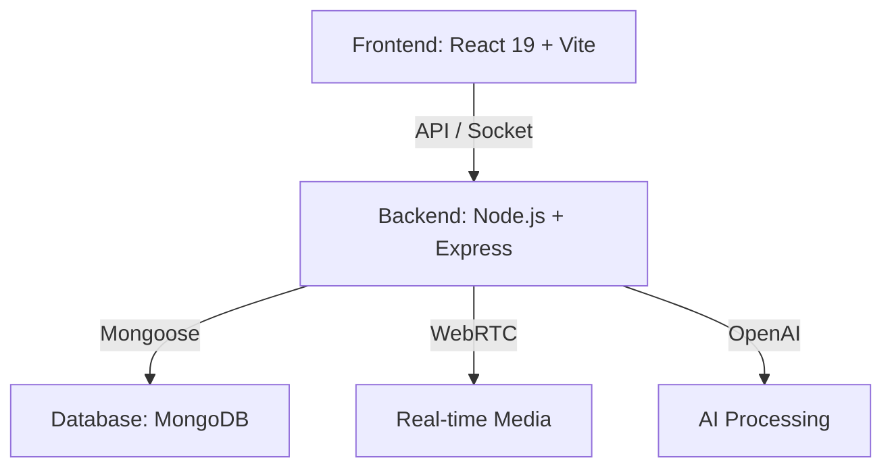
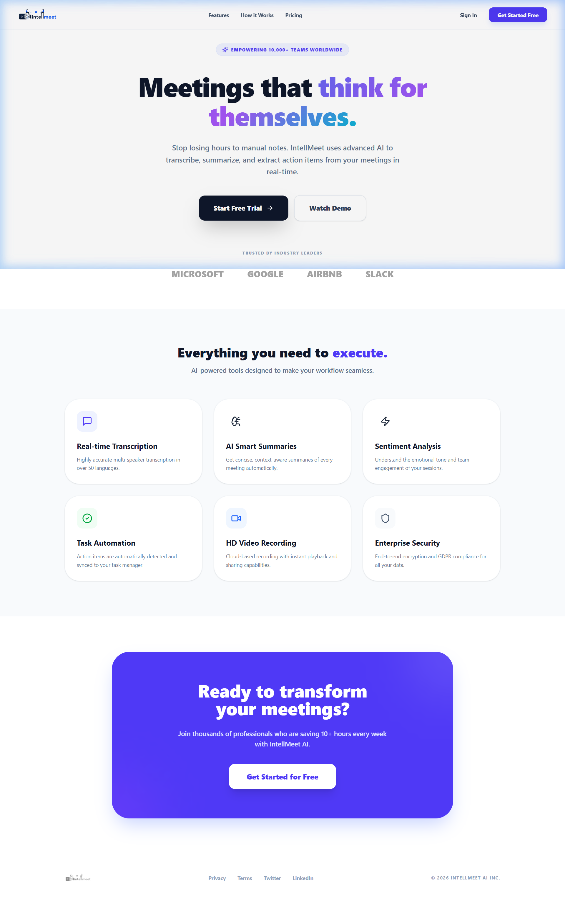
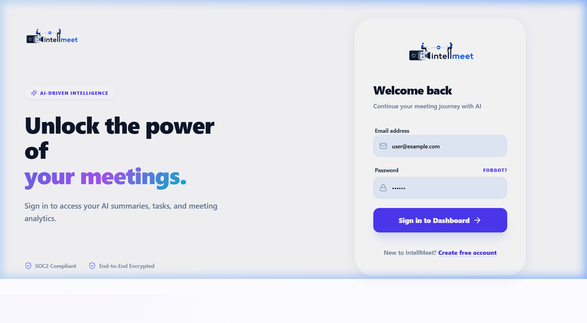
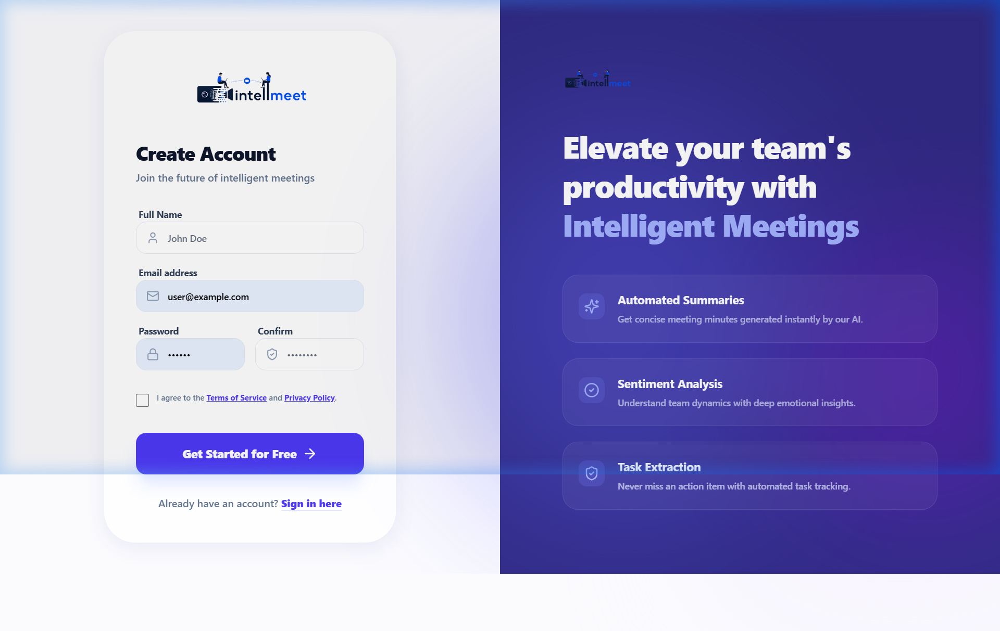
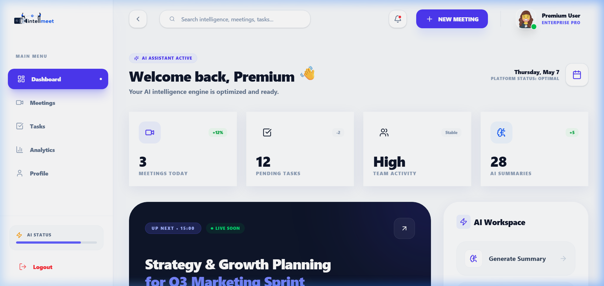

<div align="center">

# 🤖 IntellMeet
### AI-Powered Enterprise Meeting & Collaboration Platform

<p align="center">
Real-Time Video Meetings • AI Summaries • Smart Action Items • Team Collaboration
</p>

<p align="center">


</p>

<p align="center">
Production-grade MERN Full Stack Application with AI Meeting Intelligence, Real-Time Video Collaboration, Smart Task Extraction, and Enterprise Team Management.
</p>

<p align="center">
<a href="#-overview">Overview</a> •
<a href="#-key-features">Features</a> •
<a href="#️-tech-stack">Tech Stack</a> •
<a href="#-installation--setup">Setup</a> •
<a href="#-ui-preview">Screenshots</a>
</p>

</div>

---

# 📊 Project Status: UI Phase Complete ✅
The platform's **Premium UI/UX Overhaul** is now complete, featuring:
- **AI-Inspired Design**: Modern glassmorphism and smooth animations using Framer Motion.
- **Dynamic Preloader**: Custom animated entry sequence for a high-end feel.
- **Responsive Branding**: Scalable brand identity with increased logo prominence.
- **Mock Auth Logic**: Full frontend exploration capability without backend dependencies.

---

# 📌 Overview

**IntellMeet** is a next-generation AI-powered enterprise collaboration platform designed for modern remote and hybrid teams.

The platform combines:
- 🎥 **Real-time video conferencing** with high-fidelity streams.
- 🧠 **AI meeting summaries** that capture the essence of every discussion.
- 📋 **Smart action item extraction** to ensure nothing gets missed.
- 💬 **Real-time team chat** for seamless side-conversations.
- 📊 **Productivity analytics** to track team engagement and progress.

---

# 🚀 Key Features

| Feature | Description |
|----------|-------------|
| 🔐 **Secure Auth** | JWT with persistence and role-based access control. |
| 🎥 **HD Meetings** | WebRTC-powered low-latency video communication. |
| 🧠 **AI Intelligence** | Automated minutes, transcription, and sentiment insights. |
| 📋 **Smart Tasks** | Convert meeting discussions into actionable tasks automatically. |
| 📊 **Pro Dashboard** | Premium glassmorphic widgets for meeting history and analytics. |
| 🛡️ **Enterprise Ready** | SOC2-compliant architecture and end-to-end encryption. |

---

# 🏗️ System Architecture



---

# ⚙️ Tech Stack

### Frontend Core
- **React 19** & **TypeScript**
- **Vite** (Build Tool)
- **Tailwind CSS v4** (Styling)
- **Framer Motion** (Animations)
- **Zustand** (State Management)

### Backend Core
- **Node.js** & **Express.js**
- **MongoDB** (NoSQL Database)
- **Socket.io** (WebSockets)
- **WebRTC** (P2P Media)

---

# 📂 Project Structure

```bash
IntellMeet/
├── frontend/               # React + Vite frontend
├── Backend/                # Node.js + Express backend
├── screenshots/            # UI Preview assets
└── README.md               # Documentation
```

---

# 🔥 Installation & Setup

### 1. Clone & Install
```bash
# Clone the repository
git clone https://github.com/Zidioteam108/intellmeet.git
cd intellmeet

# Setup Frontend
cd frontend
npm install

# Setup Backend
cd ../Backend
npm install
```

### 2. Environment Configuration
Create a `.env` file in the `Backend/` directory:
```env
PORT=5000
NODE_ENV=development
MONGODB_URI=your_mongodb_connection_string
JWT_SECRET=your_secure_secret
CLIENT_URL=http://localhost:5174
```

### 3. Run Locally
**Terminal 1: Backend**
```bash
cd Backend
npm start
```

**Terminal 2: Frontend**
```bash
cd frontend
npm run dev
```

> **Note:** The frontend usually runs on `http://localhost:5174` (or 5173 depending on availability).

## 🚀 Deployment (Vercel)

### 1. Frontend
1. Connect your repository to Vercel.
2. Set the **Root Directory** to `frontend`.
3. Add Environment Variable: `VITE_API_URL` (URL of your deployed backend).
4. Deploy.

### 2. Backend
1. Connect your repository to Vercel (new project).
2. Set the **Root Directory** to `Backend`.
3. Add Environment Variables from `.env`.
4. Deploy.

> **⚠️ Note on Socket.io:** Vercel uses Serverless Functions. Real-time features (Socket.io) may require a persistent host like **Render** or **Railway** for optimal performance.

---

# 💡 Development Mode: Mock Auth
To explore the dashboard without setting up a database:
1. Start the frontend.
2. Go to the Login page.
3. Enter any email and password.
4. The **Mock Auth Fallback** will grant you access to the Premium Dashboard UI.

---

# 📸 UI Preview

| Landing Page | Login Page |
|--------------|------------|
|  |  |

| Signup Page | Dashboard |
|-------------|-----------|
|  |  |

---

# 📈 Future Roadmap
- [x] **Day 4** — Meeting model, CRUD APIs, meeting lobby UI, raw WebRTC demo
- [ ] **AI Voice Commands**: Control meetings with natural language.
- [ ] **Multi-language Support**: Real-time translation for global teams.
- [ ] **Calendar Integration**: Sync with Google and Outlook.
- [ ] **Mobile App**: Native iOS and Android versions.

---

# 📜 License & Author
Built by **Zidio Development** ❤️. Licensed under the MIT License.

---

<div align="center">

### 🌟 If you like this project, don't forget to star the repository 🌟

</div>
